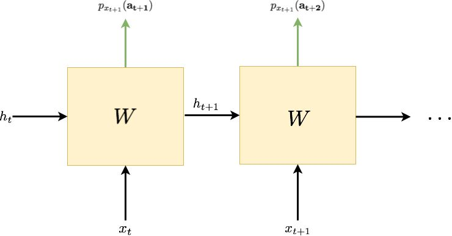
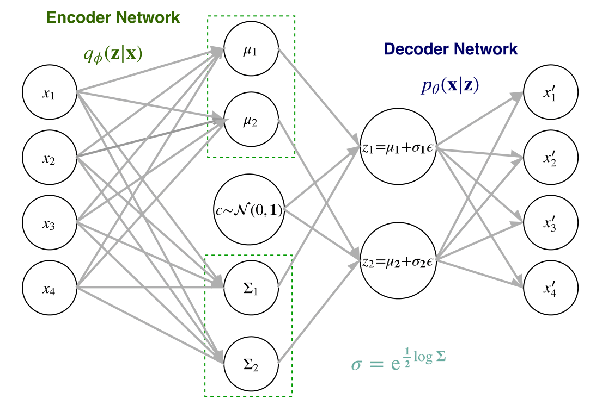
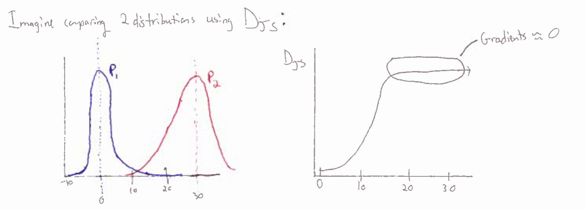
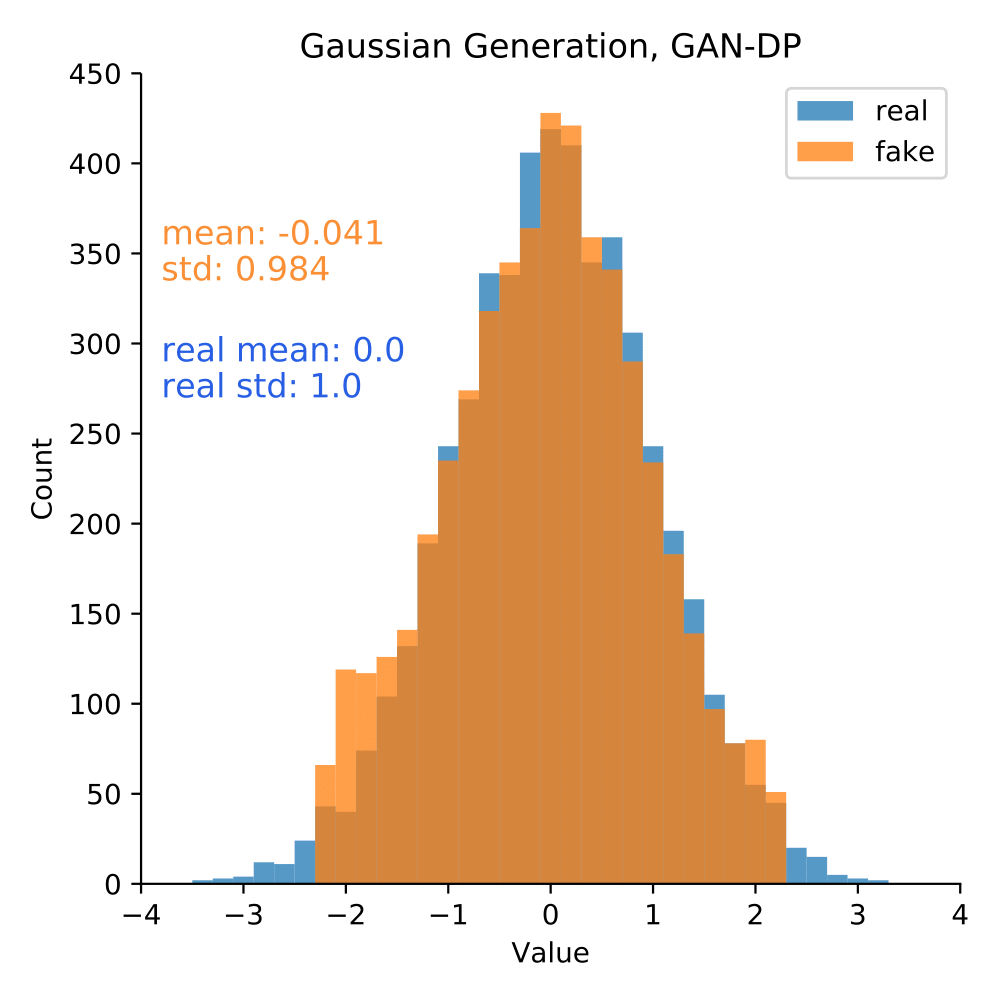

## What physicists want to know about advances in generative modeling

###### *Michael Abergo*
---------

We hope to provide you all at KITP with an overview of one class of machine learning approaches, namely generative modeling. In this, we will discuss background on what generative models try to achieve and some recent advances in their approaches. 

### What are Generative Models?

One of the major goals of machine learning is to understand the essential parameters explaining why a dataset is the way it is. Most commonly, this is seen as a problem of building a model that can learn a probability distribution that *discriminates* some data from other data. In the case of functional mapping in which a $\mathbf{y}$ is associated to an input $\mathbf{x}$, this means learning a conditional probability $p(\mathbf{y}|\mathbf{x})$, where the likelihood of the output value is predicted given some input condition. In applicable cases like classification or regression, the goal is to discriminatively ascertain likely $\mathbf{y}$ values for a given $\mathbf{x}$. Other times, when a greater understanding of a functionally mapped space is desired beyond the distribution of some output conditioned on some input, the goal is to learn a joint probability $p(\mathbf{x},\mathbf{y})$ -- to gain insight into the distribution that is responsible for *generating* the data.

Even more generally, there are many instances when there is no relational mapping or "labeling" behind the data distribution we are curious about.  That is, we are only given some $(\mathbf{x}_{1}, \dots, \mathbf{x}_n)$ that are distributed according some probability distribution $p(\mathbf{x})$. In such case, the objective is to model the true distribution $p(\mathbf{x})$ with some parameterized approximation $p_{\theta}(\mathbf{x})$ so that we can generalize on i) estimating the likelihood of some $\mathbf{x}$ in the domain and on ii) making novel samples that fall under the distribution. Approaches to this problem are detailed below.

#### Why would we want to do this?

Generative models can offer a variety of benefits or functional alternatives to discriminative approaches, some of which might be quite important for what physics want to accomplish:

- efficiently performing inference on multi-model and high-dimensional distributions
- meausring likelihoods for statistical and experimental analysis
- filling holes in existing data by extrapolating from the assembled parts of distributional knowledge
- sampling from high-dimensional distributions to make calculations
- super-resolution images

These techniques could provide insight in validating experimental setups, expedite simulation tasks, and approve data abundance/quality, among other things.

#### Evolution of neural generative models
###### Our perspectives on generative modeling with neural network approaches have evolved. Where did they start?

Unsupervised learning with neural network architectures began with Hopfield and Hinton in the 1980s with the Hopfield Network and Restrictred Boltzmann Machine (RBM). We will not go into much detail about them here, but their details can be reviewed [here](https://qucumber.readthedocs.io/en/stable/_static/RBM_tutorial.pdf) and [here](https://www.doc.ic.ac.uk/~sd4215/hopfield.html). In general, these are traditionally binary, shallow neural network models that store an associated memory of an event or learn to reconstruct input. The energy minimization principles behind them lend themselves nicely to a physics perspective, but the advent of deep learning and its interplay with statistical learning theory over the past 15 years have ushered in a new era of deep generative modeling. The main approach that we will maintain our attention toward are methods that seek to maximize the likelihood $p(x)$ of the data. 

----

### Different modern approaches to generative modeling

Each novel approach to generative modeling has its advantages and limitations. By their history and their approach to the objective of providing inference on a distribution, we can categorize generative models into three categories, as per Ian Goodfellow's NIPS 2016 [GAN tutorial](https://arxiv.org/pdf/1701.00160.pdf):

1. Explicit and **Tractable** Likelihood 
     - Pixel methods (RNN, CNN)
     - Flow based models (NICE, Real NVP, Glow)

2. Explicit and **Approximate** (bounded) Likelihood
     - Variational Bayes (autoencoding)
     - Boltzmann Machines 

3. **Implicit** Likelihood
     - GAN

Note: I might use the terms likelihood and density interchangeably here. Also note: I've included a few flow based models under the tractable likelihood category that I think are important to mention.

### 1. Explicit and Tractable Likelihood Models
----
 #### 
 Pixel RNN / CNN 

Pixel generative models are techniques that break the full likelihood estimate $p(x)$ into the product of many sequential conditional probabilities. We can imagine that you perform inference pixel by pixel and use the chain rule of probability to amass an a measure of $p(x)​$ such that:

$$
p(\mathbf{x}) = p(x_1)p(x_2| x_1)p(x_3 | x_1, x_2)... = p(x_1)\prod_{i=2}^{n} p(x_i | x_1, \dots, x_{i-1})
$$
We can take a look at an example in the context of an RNN based on some recent work by Carrasquilla et al, "Reconstructing Quantum States with Generative Models."" Imagine that we have a 1D lattice of qubits that we want to perform measurements on to infer information about the distribution of measurement outcomes and relate that to reconstructing the quantum state.

Let's say we have a 50-qubit quantum system that is governed by the Transverse-Field Ising Model 1D  Hamiltonian: 

$$
H (\sigma) = - J\sum_{i=1}^L \sigma_i^z \sigma_{i+1}^z - h\sum_i \sigma_i^x
$$
You want to be able to check on the fidelity of your setup to verify that you have properly prepared the quantum state. To do this, you want to perform inference on the density matrix of the mixed state -- to show that informationally complete measurement samples from your setup match the expected frequency associated with your intended density matrix $\rho$. With the right choice of measurements -- namely informationally complete Postive-Operator Valued Measurements for each qubit $M = \{ M^{(\mathbf{a_i})} \otimes \dots \otimes M^{(\mathbf{a_n})} \}$, we can link the probability of measurement outcomes with the invertible expression given by Born's Rule: $P(\mathbf{a}) = \mathrm{Tr}[M^{(\mathbf{a})}\rho]$. Thus, if we can gain insight into the distribution of measurement ourcomes $P(\mathbf{a})$, we can gain insight into the density matrix $\rho$. Here, each $a_i$ in $\mathbf{a}$ can take on a discrete value to represent the measurement outcome for the $i^{th}$ qubit. The number of possible outcomes is decided by which POVM measurements are used. Let's say we have the Pauli-4 POVM and we then have 4 possible measurement outcomes $a = 0, 1, 2, 3$. I will one-hot encode them to the vectors $\begin{bmatrix} 1 \\ 0 \\ 0 \\ 0  \end{bmatrix}$ $\begin{bmatrix} 0 \\ 1 \\ 0 \\ 0  \end{bmatrix}$, $\begin{bmatrix} 0 \\ 0 \\ 1\\ 0  \end{bmatrix}$, $\begin{bmatrix} 0 \\ 0 \\ 0\\ 1  \end{bmatrix}$. A given data example for our 50 qubits would be 50 of these one-hot vectors. We want to feed each of these sequentially into our RNN unit. 

An RNN is made of a recurrent unit that takes in a hidden state $h_t$ (used for updating computation at different sequential states) and an input vector $x_t$, which in our case is one of these one-hot vectors of measurement outcomes. The weight matrix $W$ is involved with some computation with $x_t$ and $h_t$ (which will vary depending on what type of RNN unit you use, like a GRU or LSTM). 

  

At the first step $t = 0$, we feed in some fixed initial $h_0$, $x_0$ of arbitrary value. The output of the RNN at the first time sequence is a probability distribution over measurement outcomes for the first qubit and an update to the hidden state $h_t$. That is, the output of the RNN on the first go will give us $\mathbf{p_t}= \begin{bmatrix} p_t(a_0) \\ p_t(a_1) \\p_t(a_2) \\p_t(a_3) \\ \end{bmatrix}$ and our new $h_t$. During training, we then take the real first qubit measurement outcome from our training example and feed that in to the RNN unit as $x_t$ with $h_t$ to get our estimate $\mathbf{p_{t+1}}$. We do this for each sequential qubit in our model. We compute the loss by calculating the cross entropy between each $\mathbf{p_t}$ and the sample from our training data $x_{t}$ for all $t​$ in our qubit chain and sum. 

When we want to sample the model, we alter this process a bit. After outputting a set of probabilities for the measurement outcome of the first qubit, we draw a sample outcome from this set of probabilities and feed that into the next step of the RNN rather than the training sample outcome. That is, say we compute the probabilities for measurement outcomes of the first qubit and get $\mathbf{p_1}= \begin{bmatrix} .78 \\ .04 \\ .1 \\ .08 \end{bmatrix}​$. We then sample from this and get $x_1= \begin{bmatrix} 1 \\ 0 \\ 0 \\ 0 \end{bmatrix}​$, and this is what we feed as input into the RNN for the next pass estimating $\mathbf{p_2}​$. Doing this for all qubits, you get a probaility distribution for each one that is dependent on the outcomes of those that preceded it. You can then start generating the measurements on 50 qubit lattices and using that to calculate expectations of observables for your density matrix $\rho​$:

You can compute the Classical Fidelity $F_c​$  and the KL-divergence $\mathrm{KL}​$ between  $P_{RNN}​$ and $P_{TFIM}​$ (ground truth):

$$
F_c = \sum_i \sqrt{P_{RNN}(i) \quad P_{TFIM}(i)}  \approx \frac{1}{N_s} \sum_i e^{\frac{1}{2} ( \log P_{RNN}(i) - \log P_{TFIM}(i))} \\ 
\mathrm{KL} = \sum_i P_{TFIM}(i) \log{\frac{P_{TFIM}(i)}{P_{RNN}(i)}} \approx \frac{1}{N_s} \sum_i ( P_{TFIM}(i) - P_{RNN}(i))
$$

For PixelCNNs rather than RNNs, imagine that the sequential steps come from 1D convolutions.

###### _Advantages:_

  - Tractable likelihood estimate is useful for inference
  - MLE provides stable training paradigms. 
  - Tractable sampling procedure.

###### *Disadvantages:*

  - Estimating complete $p(\mathbf{x})$/sampling can be slow when data has to be treated as a long sequence
  - Model can struggle to learn impact of very early parts of the probability chain on later conditional probabilities (can improve this with GRU and LSTM as RNN unit, or stacking them, but only goes so far) 
  - Ordering of sequence can be arbitrary
  - Not all data amenable to this one-hot encoding.

----

#### 
 Flow Based Models 

A recently introduced class of generative modes with explicit likelihood estimate is those that make use of normalizing flows. Normalizing flows help learn an invertible transformation $f​$ (or set of invertible transformations for deeper models) such that $f​$ performs a mapping between probability distributions. If you can make a sufficiently versatile representation of $f​$ (say, with a neural network), then you should be able to transform most any probability distribution into another. Let's build the mathematical tools out for describing this. Say we have  some $\mathbf{z} \sim p(\mathbf{z})​$ and  $\mathbf{x} \sim p(\mathbf{x})​$ and we want to learn our generative mapping $f​$ which takes some $\mathbf{x}​$ from the data space and transforms it to some  $\mathbf{z}​$ in the latent space . We can use the change of variables formula to do this if $f: \mathcal{X} \rightarrow \mathcal{Z}​$ is invertible: 
$$
\label{flowlikelihood}
p(\mathbf{x}) = p_z(f(\mathbf{x}))\bigg\lvert \det \frac{\partial f(x)}{\partial x^T}\bigg \lvert
$$
Note: because we assume $\mathbf{z}​$ is multi-dimensional, we label $\frac{\partial f(x)}{\partial x^T}​$ as the Jacobian of the $f​$. This seems simple enough, so there must be a catch. And that catch is in coming up with a way to represent a highly flexible and complicated function$f​$ that one can easily invert. A number of papers by Dinh et al. ([NICE](https://arxiv.org/pdf/1410.8516.pdf) and [RealNVP](https://arxiv.org/pdf/1605.08803.pdf)) as well as a recent paper by Kingma et al. ([Glow](https://arxiv.org/abs/1807.03039)) build up and optimize some clever methods to make this inversion possible, the basics of which we'll describe here. 

In general, it is difficult to learn invertible functions. Additionally, the above equation is computational inefficient because calculating the Jacobian of a large matrix is intractable. This can circumvented if $f​$ is constructed with what we'll call __additive or affine coupling layers__. NICE uses additive coupling layers, while RealNVP uses affine coupling layers. These layers are ways of splitting the invertible function into subparts so that the Jacobian calculation is tractable.

- Additive Coupling:
  $$
  \mathbf{y} =    \left\{ \begin{array}{ll} y_{1:d} = x_{1:d} \\ y_{d+1:D} = x_{d+1:D} + b(x_{1:d})   \end{array} \right. \\ \Downarrow \\ \mathbf{y}^{-1} =  \{ \begin{array}{ll} x_{1:d} = y_{1:d} \\ x_{d+1:D} = y_{d+1:D} - b(x_{1:d})   \end{array}
  $$

- Affine Coupling:
  $$
  \mathbf{y} =    \left\{ \begin{array}{ll} y_{1:d} = x_{1:d} \\ y_{d+1:D} = x_{d+1:D} \odot \exp{(s(x_{1:d})) + t(x_{1:d})}  \end{array} \right. \\ \Downarrow \\ \mathbf{y}^{-1} =  \{ \begin{array}{ll} x_{1:d} = y_{1:d} \\ x_{d+1:D} =(y_{d+1:D} - t(y_{1:d})) \odot \exp{(-s(y_{1:d}))}   \end{array}
  $$

- Coupling + 1x1 Convolutions:

  - These are used in the Glow paper to help with image understanding. Details can be found in their paper and aren't esseential for understanding the flow-based modeling framework. 

    

The coupling allows for us to compute a Jacobian defined by a triangular matrix, which is significantly more efficient than would otherwise be possible. The Jacobian $J$ of these coupled functions looks like: 
$$
J = \frac{\partial \mathbf{y}}{\partial\mathbf{x}} = \begin{bmatrix} 1 & \dots & \dots & 0 \\ \frac{\partial y_2}{\partial x_1} & 1 & \dots & 0 \\ \vdots & \vdots & \ddots  & 0  \\ \frac{\partial y_{D}}{\partial x_{1}} & \frac{\partial y_{D}}{\partial x_{2}} & \dots & \frac{\partial y_{D}}{\partial x_{D}}  \end{bmatrix}  = \begin{bmatrix} \mathbf{I}_d & \mathbf{0}_d \\ \frac{\partial y_{d+1:D}}{\partial x_{1:d}}  & \frac{\partial y_{d+1:D}}{\partial x_{d+1:D}} \end{bmatrix}
$$
where $I_d​$ is the identity matrix of dimension $d​$. We write it like such to show the familiar form of a 2x2 matrix. This is really convenient! We need to calculate the determinant of this matrix to do our transformations and inverse transformations between probability density functions. If you recall that for a 2x23 matrix $M = \begin{bmatrix} a & b \\ c & d \end{bmatrix}​$ , $\det{M}  = \frac{1}{ad - bc}​$, we can see that the determinant of our Jacobian is just the determinant of the smaller sub matrix defined by $\frac{\partial y_{d+1:D}}{\partial x_{d+1:D}}​$. For as complex a transformation as the affine coupling, this only amounts to being able to compute: 
$$
\det{J} = \det{\begin{bmatrix} \mathbf{I}_d & \mathbf{0} \\ \frac{\partial y_{d+1:D}}{\partial x_{1:d}}  & \mathrm{diag}(\exp{(s(x_{1:d})))}\end{bmatrix}} = \exp(\sum_{k=1}^{D-d} s(x_{1:d})_k)
$$
If you stack at least two of these coupling layers together, you can transform all of your data. Moreover, one can see that computing neither the Jacobians, nor the inverses, require explicit sub-computations of the scaling in NICE (function $m$) or the scaling and transformation in RealNVP (functions $s$ and $t$). As such, these functions can be complicated and that won't impact the difficulty in calculating the inverse or the Jacobian. 

With this flexibility of inversion, we can perform sampling and exact inference. If I draw some $\mathbf{z}$ from $p_z$ and I know $p_z$ is an analytically known distribution like a Gaussian $\mathcal{N}(0,\mathbb{I} )$, I can pass it through $f^{-1}$ to get a sample $\mathbf{x}$ from $p_x$. If I want to perform inference on a sample $\mathbf{x}$, I can pass it through $f$ to understand its likelihood in the known latent density:

  

In practical optimization contexts, we maximize the log likelihood of the data rather so that the multiplication in Equation $\ref{flowlikelihood}$ can be split into additive terms whose optimization is more manageable to pursue: 
$$
\label{flowloglikelihood}
\ln p(\mathbf{x}) = \ln \big(p_z(f(\mathbf{x}))\big) + \ln \bigg(\bigg\lvert \det \frac{\partial f(x)}{\partial x^T}\bigg \lvert \bigg)
$$

###### _Advantages_: 

- Efficient and exact inference $\rightarrow​$ done through estimating the log density
- Efficient image reconstruction $\rightarrow$ invertibility

###### _Disadvantages_:

- Generally need to stack many coupling layers together, which, additively, can be computationally slow
- Images can be less resolved than with GAN, but recent updates like with Glow have challenged that claim!
- There are restrictions still on what functions we make because of needing a cheap Jacobian to compute, but [Duvenaud et al.](https://arxiv.org/pdf/1810.01367.pdf) recently introduced a technique for using their Neural ODEs to do circumvent this 

**Note**: Flow-based techniques can be combined with other approaches! For example, normalizing flows were introduced to VAEs in 2015  with the paper BLANNNKKKK by BLANKKKKK, and autoregressive models can be hybridized with flow techniques, as per Inverse Autoregressive Flows and Masked Autoregressive Flows. 

We hope to include a tutorial in the coming days, which will be linked to here. 

### 2. Explicit and Approximate Likelihood Models

---------

#### 
 Variational Autoencoders

Under a similar vein as the flow based models in which we map our data $\mathcal{X} = \{\mathbf{x}\}_{i=1}^n​$ to some known tractable variable  $\mathcal{Z} = \{\mathbf{z}\}​$, we can also approach this problem that the $\mathbf{z}​$ variables are actually a set of hidden or latent variables that drive processes from which the data $\mathbf{x}​$ are generated. That is, we can imagine that these latent variables drive and can be used to explain the observable data and how its distributed. This is called the [latent variable model](https://en.wikipedia.org/wiki/Latent_variable_model) and has been used often in statistical modeling. By such, it is often used in research in the machine learning community, but it has a few limitations. We can describe the process of inference on $p(\mathbf{x})​$ as calculating 
$$
p(\mathbf{x}) = \int_\mathbf{z} p(\mathbf{x},\mathbf{z}) = \int_{\mathbf{z}} p(\mathbf{x} | \mathbf{z}) p(\mathbf{z}) \, \mathrm{d}\mathbf{z}
$$
We run into the problem of having to marginalize out all of $\mathbf{z}$ to exactly calculate $p_x$. For high-dimensional systems that we often encounter in machine learning.  In such case, we also can't access it through non-integral Baye's Rule because the posterior density $p(\mathbf{z} |\mathbf{x})$ is also intractable. To overcome this, [Kingma and Welling](https://arxiv.org/pdf/1312.6114.pdf) proposed a method of putting an optimizable lower bound on $p(\mathbf{x})$ so that one can have a model that provides approximate, bounded measure of the likelihood of the data. 

Let's take this latent model and run with it a bit. We want to generate some $\mathbf{x}​$ from $\mathbf{z}​$ and thereby need a model which tell us about $p(\mathbf{x} | \mathbf{z})​$. We can estimate this with a neural network defined by parameters $\theta​$ as $p_{\theta}(\mathbf{x} | \mathbf{z})​$ that will tell us about the probability of observing some $\mathbf{x}​$ given some $\mathbf{z}​$ to be *decoded*. We can choose our latent space to follow some simple distribution such as a Gaussian so $p(\mathbf{z}) = \mathcal{N}(\mathbf{0}, \mathbb{I})​$. Because marginalizing out $\mathbf{z}​$ is intractable, we have to start by performing inference on $p(\mathbf{x} | \mathbf{z})​$. We can facilitate this by first encoding our data into a latent space by learning to model $p(\mathbf{z} | \mathbf{x})​$. We can estimate this with a neural network defined by parameters $\phi​$ as $q_{\phi}(\mathbf{z} | \mathbf{x})​$, where $q​$ will be used to represent the density of our samples that are *encoded* into the latent space. 

I have used the words decode and encode to hint at the structure of the model. These words are used often to describe the two subparts of an __autoencoder__. A conventional autoencoder is a deterministic framework for learning to encode data $\mathbf{x}$ into a dimensionally reduced space and then subsequently decode it for reconstruction. If the data can be reconstructed from the dimensionally reduced space, then the dimensionally reduced space captures the information behind the data well. 

In our context, we want to put a probabilistic spin on this interpretation, where now the encoder represents our probability distribution $q_{\phi}(\mathbf{z} | \mathbf{x})$ and the decoder represents our $p_{\theta}(\mathbf{x} | \mathbf{z})$. We can write out an approximation for the log-likelihood of the data with these terms, as is done [here](https://www.youtube.com/watch?v=5WoItGTWV54&t=3127s): 
$$
\begin{equation} \label{eq1}
\begin{split}
\ln p_{\theta}(\mathbf{x}) & = \mathrm{\mathbb{E}}_{\mathbf{z} \sim q_\phi(\mathbf{z}|\mathbf{x})} [\ln p_\theta(\mathbf{x})]\\
 & = \mathrm{\mathbb{E}}_{\mathbf{z} \sim q_\phi(\mathbf{z}|\mathbf{x})} [\ln \frac{p_\theta(\mathbf{x} | \mathbf{z})p_\theta(\mathbf{z})}{p_\theta(\mathbf{z} | \mathbf{x})}  \frac{q_{\phi}(\mathbf{z} | \mathbf{x})}{q_{\phi}(\mathbf{z} | \mathbf{x})}] \\
 & = \mathrm{\mathbb{E}}_{\mathbf{z} \sim q_\phi(\mathbf{z}|\mathbf{x})} [\ln p_\theta(\mathbf{x} | \mathbf{z})] - \mathrm{\mathbb{E}}_{\mathbf{z} \sim q_\phi(\mathbf{z}|\mathbf{x})} [ \ln\frac{q_{\phi}(\mathbf{z} | \mathbf{x})}{p_\theta(\mathbf{z})}] + \mathrm{\mathbb{E}}_{\mathbf{z} \sim q_\phi(\mathbf{z}|\mathbf{x})} [\ln\frac{q_\phi(\mathbf{z} | \mathbf{x})}{p_\theta(\mathbf{z} | \mathbf{x})}] \\
 & = \mathrm{\mathbb{E}}_{\mathbf{z} \sim q_\phi(\mathbf{z}|\mathbf{x})} [\ln p_\theta(\mathbf{x} | \mathbf{z})] - D_{\mathrm{KL}}(q_\phi(\mathbf{z}|\mathbf{x}) \,|| \,p_\theta(\mathbf{z})) + D_{\mathrm{KL}}(q_\phi(\mathbf{z}|\mathbf{x}) \,|| \,p_\theta(\mathbf{z}|\mathbf{x}))
\end{split}
\end{equation}
$$
We expand the log-likelihood into terms from our model and end up with three. The expectation over $\mathbf{z}$ equates the last two logarithmic fractions to KL-divergences. The __first__ term is a posterior likelihood term that can be approximated on small minibatches with with a mean square error or a binary cross entropy.  We can consider the reconstruction loss term as ensuring that real samples are embedded into the latent distribution and forcing the decoding function to be an approximate inverse of the encoding function. The __second__ term is a measure of the similarity between the encoded distribution $q_\phi(\mathbf{z} | \mathbf{x})$ and our (generally) Gaussian prior, and the third term is intractable. However, $D_{KL} (\cdot || \cdot) \geq 0$, so the first two terms can still function as a differentiable lower bound on the log-likelihood $\ln p_\theta(\mathbf{x})$ -- also known as the also known as the *evidence lower bound* (ELBO). 
$$
\ln{p(\mathbf{x})} \geq \mathrm{\mathbb{E}}_{\mathbf{z} \sim q_\phi(\mathbf{z}|\mathbf{x})} [\ln p_\theta(\mathbf{x} | \mathbf{z})] - \beta \, D_{\mathrm{KL}}(q_\phi(\mathbf{z}|\mathbf{x}) \,|| \,p_\theta(\mathbf{z}))
$$
Because it is differentiable, it can be optimized to maximize the lower bound of the likelihood. Using this variational principle, this has been dubbed a variational autoencoder (VAE). Note the $\beta$ value included the bound. The addenedum is known as the $\beta$-VAE and helps control the conditional independence of the latent space (and thus helps with the adoption of conditional information) and improves the efficiency of the latent representation. It comes with a tradeoff though of poorer image reconstruction, as the first term is made comparatively less important in the loss. 

 

Graphs of prototypical autoencoders and VAEs models are shown in the figure above to highlight their differences. An important distinction beyond the different objective function is in the encoding bottleneck. Instead of encoding down to some single latent representation, a VAE encodes to two bottlenecks -- a mean vector and a variance vector. The latent vector is then created by sampling the mean vector, the variance vector, and combining these samples with a noise term $\epsilon​$. This is to permit the VAE to generate new samples while still allowing the graph to be differentiable for backpropagation optimization and is known as the reparameterization trick. Autoencoders and VAEs are only cousins because of their encoding and decoding paradigm; otherwise, they are conceptually (Bayesian vs deterministic) and functionally (reductive vs generative) quite different.

You might be asking why the encoder maps to a $\mu$ and $\ln \Sigma$ ? This is to make the calculation of that second KL-term analytically calculable. Those two parameters define the Gaussian $q_\phi(\mathbf{z}|\mathbf{x})$ for us, so we can compute a closed form representation of $D_{\mathrm{KL}}(q_\phi(\mathbf{z}|\mathbf{x}) \,|| \,p_\theta(\mathbf{z}))$ by treating $\mu$ and $\Sigma$ as functions of $\mathbf{x}$:
$$
\begin{equation}
\begin{split}
D_{\mathrm{KL}}(q_\phi(\mathbf{z}|\mathbf{x}) \,|| \,p_\theta(\mathbf{z})) &= D_{\mathrm{KL}}(\mathcal{N}\big(\mu(\mathbf{x}),\Sigma(\mathbf{x})\big) \,|| \,\mathcal{N}(\mathbf{0},\mathbb{I})) \\
& = \frac{1}{2}\bigg(\sum_d (\Sigma(\mathbf{x}) + \mu^2(\mathbf{x})) -  \ln\prod_d \Sigma(\mathbf{x}) \bigg) - \frac{1}{2}d \\
& = \frac{1}{2}\bigg(\sum_d \Sigma(\mathbf{x}) + \mu^2(\mathbf{x}) - 1 -  \ln\Sigma(\mathbf{x}) \bigg) \\
& = \frac{1}{2}\bigg(\sum_d \exp(\Sigma(\mathbf{x})) + \mu^2(\mathbf{x}) - 1 -  \Sigma(\mathbf{x}) \bigg)
\end{split}
\end{equation}
$$
where $d$ is the dimensions of the latent space, and, in the last line, we switch to the exponent because one achieves more stable results computing $\ln\Sigma$ than $\Sigma$ (as seen in the graphical representation above). 

So what does the training process look like then? It's much like a balance optimization between being able to reconstruct images and ensuring that $q_{\phi }(\mathbf{z} | \mathbf{x})​$ looks Gaussian for all $x​$. We can imagine that below, where we can envision 2D Gaussians for each $\mathbf{x}​$ getting near or close to the prior Gaussian $\mathcal{N}(\mathbf{0}, \mathbb{I})​$:

<figcaption>Mapping from 2D latent space. Cool visualization thanks to Wasserstein Autoencoders paper by Tolstikhin et al 2018. </figcaption>

As the KL term is more strongly enforced, data will be better spread around the Gaussian prior, but the generated image quality will be worse. If the KL term is not enforced as strongly (as might be seen above), posterior Gaussians can overlap, and multiple inputs might map to the same generated $\mathbf{x}'$. This can be improved with the Wasserstein Autoencoder by [Tolstikhin et al](https://arxiv.org/pdf/1711.01558.pdf) in which $q(\mathbf{z}) = \int q(\mathbf{z} | \mathbf{x} ) dp(\mathbf{x})$ is forced to match $p(\mathbf{z})$ rather than each $q_{\phi}(\mathbf{z}|\mathbf{x})$ on their own. __Note__: there are many many advances and perspectives on these models, and more keep coming. I just reference the Wasserstein Autoencoder case because it elucidates some of the behavior of the latent space visually well. 

For example of some other advances in the understanding, one can take a look at ways of disentangling the latent space of these models so that each latent dimension has some more interpretable understanding of its representation. This can be done by enforcing independence between the latent dimensions, which becomes apparent if you break down the KL term into its newly discovered 3 subparts, one of which is the [Total Correlation](https://arxiv.org/pdf/1802.04942.pdf). This can be done [adversarially](https://arxiv.org/pdf/1802.05983.pdf), with d-Hilbert-Schmidt [Independence Criteria](https://arxiv.org/pdf/1805.08672.pdf), or with MMD and[ variations of adversarial](http://malbergo.me/FinalPresentationMicrosoft.pptx) training. One can also tailor their latent space to be a [sampling on a manifold(https://arxiv.org/pdf/1807.04689.pdf) that corresponds to the symmetries/transformations that govern the true data. 

###### _Advantages_: 

- Stable training that can be controlled by tradeoff between reconstruction and KL
- Easy to sample from the posterior.

###### _Disadvantages_:

- limited image resolution because of MLE reconstruction term. 
- Need monte-carlo sampling of latent space to perform exact inference $p(\mathbf{x} )​$

#### 2. Implicit  Likelihood Models

------

#### 
 Generative Adversarial Networks

A common dilemma in generative modeling is choosing the right evaluation metric in your training regime,  as we have seen that likelihood calculations on latent variable models (as well as other MLE approaches using energy maximization techniques) can be quickly intractable. Moreover, these methods generally give a limited resolution on samples generated by the model. A novel training technique known as adversarial training replaces the traditional likelihood estimation with a trainable network, whose task is to discriminate generated samples that came from a $p_{\theta}(\mathbf{x})$ implicitly learned by a model from those of the true $p(\mathbf{x})$. [Generative adversarial networks](https://papers.nips.cc/paper/5423-generative-adversarial-nets) (GANs) conceived in recent years follow this paradigm. 

GANs function as a competition between two competing neural networks - a generator and a discriminator -- which are both represented by functions that are differentiable with respect to inputs and weight parameters. Let's say that the  discriminator and generator have trainable network parameters $\mathbf{\phi}$ and $\mathbf{\theta}$ respectively. The generator takes in some latent noise vector $\mathbf{z}$ and seeks to output a conditional signal $p_{\theta}(\mathbf{x} | \mathbf{z})$. The discriminator takes in either the output of the generator which is a sample from the approximate distribution or a sample from the true distribution and outputs a value of the probability that the given sample is real or counterfeit.  The two functions share a cost function $V$ -- one that the generator tries to minimize and the discriminator tries to maximize: 
$$
\begin{equation}
\label{eq:ganObjective}
%\vspace{-0.2cm}
\min_{G} \max_{D} V (D, G) = \mathrm{\mathbb{E}}_{x}[\ln(D_{\mathbf{\phi}}(\mathbf{x}))] +  \mathrm{\mathbb{E}}_{z}[\ln(1- D(G_{\mathbf{\theta}}(\mathbf{z}))]
\end{equation}
$$
The two networks are thus jointly optimized in tandem with one another, and can be visualized like below:

Let's break down what this optimization process looks like a bit more and see what happens when we have an optimal discriminator $D^*$. I will describe the above cost function $V$ with the full distributions so we can use integrals rather than expectation:
$$
\begin{equation}
\begin{split}
V(D,G) &= \int_x p_{real}(x)\log D(x) dx + \int_z p_z(z) \log(1-D(G(z))) dz \\
&= \int_x p_{real} \log{D(x)} + p_{g}(x)\log(1-D(x))\, dx \quad 
\end{split}
\end{equation}
$$
where $p_{g}$ is the probability that the generator produces $x$. The optimal discriminator to maximize this (quick proof on continuous space provided in original GAN paper) is given by: 
$$
D^*_{\phi}(x) = \frac{p_{real}(x)}{p_{real} + p_{g}}
$$
Using this, we rewrite our value function as:
$$
\begin{equation}
\begin{split}
V^* = \min_{G} V(D^*,G) & = \mathrm{\mathbb{E}}_{x}[\log(D^*_{\mathbf{\phi}}(\mathbf{x}))] +  \mathrm{\mathbb{E}}_{x\sim p_g}[\log(1- D^*_{\phi}(x))] \\
& = \mathrm{\mathbb{E}}_{x}\bigg[\log{\frac{p_{real}(x)}{p_{real} + p_{g}}}\bigg] +  \mathrm{\mathbb{E}}_{x\sim p_g}\bigg[\frac{p_{g}(x)}{p_{real} + p_{g}}\bigg]
\end{split}
\end{equation}
$$
when $p_g$, $D^* = \frac{1}{2}$. This is the optimal scenario for training, as our distributions would match. In this case, we have
$$
\mathrm{\mathbb{E}}_{x}\bigg[ \log \frac{1}{2}\bigg] + \mathrm{\mathbb{E}}_{x\sim p_g}\bigg[ \log \frac{1}{2}\bigg] = -\log 4 
$$
is the lowest value of the cost. Factoring this value from the right-hand-side of $V^*$ will give us the minimum plus whatever needs to be minimized to 0 to achieve that minimum:
$$
\begin{equation}
\begin{split}
V^* &= -\log 4 +  \mathrm{\mathbb{E}}_{x}\bigg[\log{\frac{p_{real}(x)}{(p_{real} + p_{g})/2}}\bigg] +  \mathrm{\mathbb{E}}_{x\sim p_g}\bigg[\frac{p_{g}(x)}{(p_{real} + p_{g})/2}\bigg] \\
& = -\log4 + D_{KL}\big(p_{real} || \frac{p_{real} + p_g}{2}\big) + D_{KL}\big(p_{g} || \frac{p_{real} + p_g}{2}\big) \\
&= -\log 4 + D_{JS}\big(p_{real} \,||\, p_g\big)
\end{split}
\end{equation}
$$
Thus, the training process on this value function with an optimal discriminator has been shown to be equivalent to minimizing the Jensen-Shannon divergence given by:
$$
\begin{equation}

D_{\mathrm{JS}} = \frac{1}{2} D_{\mathrm{KL}}(p_{real} || \frac{1}{2}(p_{real} + p_{g})) + D_{\mathrm{KL}}(p_{g} || \frac{1}{2}(p_{real} + p_{g}))  
\end{equation}
$$
 for KL divergence $D_{\mathrm{KL}} (P||Q) = - \sum_{i} P(i) \ln\frac{P(i)}{Q(i)}​$. The ultimate goal is for the generator to create samples that are coming from an approximate distribution so close to the real distribution that the discriminator can no longer tell them apart from real samples. It should be noted that because in real world applications the model does not have access to the full distribution $p(\mathbf{x})​$, the generator can only best learn the training distribution $\hat{p}(\mathbf{x})​$. 

While this approach is very powerful because of the flexible, parameterized replacement for the likelihood that allows for the generator to adeptly model multi-modal output, there are a number of limitations to the original GAN framework. These limitations could arise from a number of theoretical problems as detailed in a paper by [Roth et al 2017](https://arxiv.org/abs/1705.09367) --  overfitting, density misspecification or dimensional misspecification -- and are often driven by the generator or discriminator outperforming the other. Two symptoms appear because of this problem one we'll call mode collapse and/or vanishing gradients as well as non-convergence, where the parameters of the model continue to oscillate back and forth. We can visualize why the model will not update significantly if the generated and empirical distribution produced are too far apart:

<figcaption> Showing how JS Divergence saturates when distributions are far apart, visualizaiton taken from Jonathan Hui on Medium</figcaption> 

As you can see in the graph, when the distributions are far apart, the JS Divergence flattens, in which case only small gradients would be backpropagated.

There have been many proposed solutions and further analysis of GAN dynamics, but I'll highlight two here which work well in practice. I will refer to them as the __Wasserstein GAN__ and the GAN with __discriminator gradient penalty__. 

1. [Wasserstein GAN](https://arxiv.org/abs/1701.07875) (WGAN and WGAN-GP):

   The idea behind the Wasserstein GAN is to replace the f-divergence with an integral probability metric. That is, the GAN is refrmed as a question of optimal transport (OT), in which our goal is to learn and minimize the best measure (minimum cost) of how much density of the model distribution need to be moved to make it equal to the true distribution. In this case, we replace the JS Divergence minimization problem with one of minimizing the Wasserstein distance $W(p_r, p_g)$ between the distributions:
   $$
   W(p_r,p_g) = \inf_{\gamma \in \prod(p_r,p_g)} \mathrm{\mathbb{E}}_{x,y \sim \gamma}\big[||x - y||\big]
   $$
   This is also known as the Earth-Mover distance. $\prod(p_r,p_g)$ is the set of all joint distributions $\gamma(x,y)$ whose marginals are $p_r, p_g$. The infimum is the greatest lower bound for any transport plan. We want to minimize the greatest lower bound to ensure we've definitely overlapped the distributions. In reality, this equation is intractable to estimate, but can be expressed under 1-Lipschitz constraint as:
   $$
   W(p_r,p_g) = \sup_{||f||_L \leq 1} \mathrm{\mathbb{E}}_{x\sim p_r}\big[f(x)\big] - \mathrm{\mathbb{E}}_{x\sim p_g}\big[f(x)\big]
   $$
   1-Lipschitz functions are just functions for which their slopes/gradients are always less than or equal to 1: $\frac{|f(x) - f(y)|}{|x - y|} \leq 1 $. This simplification can be derived via the Kantorovich-Rubinstein duality.

   Moreover, this new metric gives us a _new_ objective! The discriminator is no longer tasked with outputting a probability that the sample is real or fake, but rather is tasked with learning this supremal function f(x) that outputs a score of distributional distance. When the score is minimized, you're distributions should overlap. As such, one should remove the sigmoid activation at the end of their original GAN discriminator because the score is not a probability. 

   One issue with this original proposal is that it is hard to enforce this Lipschitz constraint when learning $f(x)$. A way to enforce this constraint is proposed in [Improved Training of Wasserstein GANs](https://arxiv.org/abs/1704.00028), in which a regularizer is applied to the objective that forces the gradients of the discriminator to be less than 1:
   $$
   L = \mathrm{\mathbb{E}}_{\tilde{x}\sim p_g}\big[D(\tilde{x})\big] - \mathrm{\mathbb{E}}_{x\sim p_r}\big[D(x)\big] + \lambda\mathrm{\mathbb{E}}_{\hat{x}\sim p_{\hat{x}}}\big[(||\nabla_{\hat{x}}D(\hat{x})||_2 - 1)^2\big]\\ \mathrm{where} \quad \hat{x} = t\tilde{x} + (1-t)x \quad \mathrm{for} \, t \sim [0,1]
   $$

2. [GAN w/ Discriminator Gradient Penalty](https://arxiv.org/abs/1705.09367) (GAN-DP):

   A gradient penalty can also be applied to the original GAN framework. This method was shown to be locally convergent whereas the WGAN-GP was not, though both work decently in practice under the right hyperparameters. I would say from my experience that GAN-DP is less fragile with respect to small changes in the model. 
   $$
   L = \mathrm{\mathbb{E}}_{x}[\ln(D_{\mathbf{\phi}}(\mathbf{x}))] +  \mathrm{\mathbb{E}}_{z}[\ln(1- D(G_{\mathbf{\theta}}(\mathbf{z}))] + \frac{\gamma}{2}\mathrm{\mathbb{E}}_{x}\big[||\nabla D_{\phi}(x)||^2\big]
   $$
   The penalty is on the gradient of the discriminator on real data, and helps keep the model headed toward and around Nash-equilibrium. 

We can use these techniques to sample from very complex distributions, but for now here's a tutorial on sampling from some simple analytic distributions:

The tutorial can be found [here](https://github.com/malbergo/GenerativeModelTutorials/blob/master/VanillaGan_Gaussian.ipynb). 

###### _Advantages_:

- can produce high fidelity samples with implicit likelihood
- natural sampling procedure

###### _Disadvantages_: 

- no exact inference 

This page will be continuously updated. 