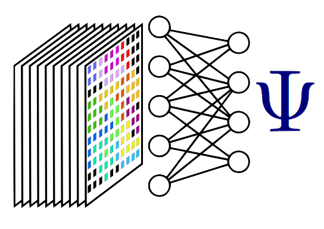

   
 
## Welcome to KITP Machine19

Welcome to the wiki page for the KITP program [Machine Learning for Quantum Many-Body Physics](https://www.kitp.ucsb.edu/activities/machine19), coordinated by Roger Melko, Amnon Shashua, Miles Stoudenmire, and Matthias Troyer. 

This space is for you, the program participants.  Contact [Roger](mailto:rgmelko@gmail.com) or [Miles](mailto:mstoudenmire@flatironinstitute.org) with your GitHub userid to get access to make changes to the page.
You can use the [editor on GitHub](https://github.com/machine19/machine19.github.io/edit/master/README.md) to maintain and preview the content for this website in Markdown files.

A [slack](https://slack.com) workspace has been created at machine19.slack.com.  If you haven't recieved your invitation contact Roger.

----------------

### Weekly Schedule Format

Every week, we will have one organizational meeting, three scheduled talks, and one imprompto (and un-recorded) Friday discussion.  All events take place in the KITP auditorium.

- Monday, 1:30pm: Organizational meet & greet
- Tuesday, 1:30pm: Seminar
- Wednesday, 10:00am: Chalkboard Tutorial (introductory level machine learning for physicists)
- Thursday, 1:30pm: Seminar
- Friday, 3:30pm: **Machine19 Unplugged**, un-recorded discussion.  Topics to be determined by you, the participants, each week.

Following the Friday discussion there will be a social event at the Munger residence.  Details will be announced weekly.

----------------

### Wednesday BlogSpot
- Michael Albergo: [Overview of Recent Generative Models](machine19.github.io/Blogs/Albergo_GenModels/GenModels.html)
- Dries Sels: [Tutorial: Reinforcement Learning for Physicists](machine19.github.io/Blogs/TutorialRL.pdf)
- Estelle Inack: [Tutorial: VMC and Machine learning](machine19.github.io/Blogs/VMCandmachinelearningKITPtutorialnotes.html)

----------------

### Useful links

- [Attendees](http://online.kitp.ucsb.edu/online/machine19/directory.html)
- [Current week schedule](https://www.kitp.ucsb.edu/talks-schedule#week)
- [Recorded talks](http://online.kitp.ucsb.edu/online/machine19/)

----------------

### Upcoming Events

+ **Week 6**
  - Wed Mar 6 (10:00am) Tutorial: *Jing Chen*
  - Thu Mar 7 (1:30pm) Seminar: *John Terilla*

